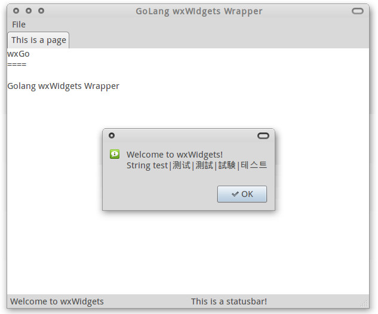

wxGo
====

Golang wxWidgets Wrapper

[](https://travis-ci.org/dontpanic92/wxGo)
[](https://ci.appveyor.com/project/dontpanic92/wxgo/branch/master)

Not actively maintained
----
Please feel free to folk and make your changes. I'm still available through GitHub Issues for any questions.

Notes
----
For Golang 1.10.0 and 1.9.4, there is a "Invalid flag" issue which causes the build fails. Please check [Here](https://github.com/dontpanic92/wxGo/issues/44#issuecomment-368310742) for workaround.

Compilation 
----

Currently wxGo can compile and run on Windows, Linux and Mac OS X on amd64 architecture.

#### 1. Requisites

- 64-bit Go
- GCC / MinGW ver > 5 for Linux / Windows
- \> 5GB Memory space

__Remarks__

32-bit go will [run out of memory](https://github.com/dontpanic92/wxGo/issues/3) due to ~5GB memory consumption when compiling and I have no idea on how to decline the memory usage. Any suggestion or discussion will help.

The precompiled wxWidgets is compiled with gcc > 5 ( 6.2.1 on Linux, 5.3.0 on Windows using tdm-gcc). So if you want to use the precompiled wxWidgets, your gcc version has also to be > 5, because [GCC changed its ABI since GCC 5 release series](https://gcc.gnu.org/gcc-5/changes.html#libstdcxx).


#### 2. Build & Install

```
go get github.com/dontpanic92/wxGo/wx
```

You can add `-x` option to print each command it executes.

Custom Compilation
----

This section will introduce how to customize wxGo.

#### 1. Compilation phases

wxGo needs a 2-phase compilation. The first is the SWIG phase, that is using [SWIG](https://github.com/SWIG/SWIG) to generate the wrapper code. And the second is the Go phase, which has been described above.


#### 2. Customize SWIG phase

You can regenerate the wrapper code using SWIG. Compilation dependencies are:

- python 2 or 3
- sed
- make
- A customized SWIG


We use a customized SWIG to generate the wrapper code. Please clone https://github.com/dontpanic92/SWIG and simply `./configure && make && sudo make install`. Then you can modify the source as you want, and run `make` in the `build` folder.

#### 3. Customize wxWidgets build

If you want to use other wxWidgets build rather than the precompiled one, what you have to do is quite simple.

- Compile wxWidgets
- Run `go get -d github.com/dontpanic92/wxGo/wx` to let the go-tool just download the source
- Open `wx/setup_OS_ARCH.go`, change the `CPPFLAGS` and `LDFLAGS`
- Run `go install github.com/dontpanic92/wxGo/wx`

Done!

Usage
----

After importing `github.com/dontpanic92/wxGo/wx`, the following code will create an empty dialog with a "Hello World" as its caption.

```go
    wx.NewApp()
    f := wx.NewDialog(wx.NullWindow, -1, "Hello World")
    f.ShowModal()
    f.Destroy()
```

All the wx-Classes' objects can be created using `wx.NewCLASS`. Now let us add some controls on it :

```go
    wx.NewApp()
    f := wx.NewDialog(wx.NullWindow, -1, "Hello World")

    bSizer := wx.NewBoxSizer(wx.VERTICAL)

    checkBox := wx.NewCheckBox(f, wx.ID_ANY, "Check Me!", wx.DefaultPosition, wx.DefaultSize, 0)
    bSizer.Add(checkBox, 0, wx.ALL|wx.EXPAND, 5)

    textCtrl := wx.NewTextCtrl(f, wx.ID_ANY, "", wx.DefaultPosition, wx.DefaultSize, 0)
    bSizer.Add(textCtrl, 0, wx.ALL|wx.EXPAND, 5)

    f.SetSizer(bSizer)
    f.Layout()
    f.ShowModal()
    f.Destroy()
```

And then we can bind an event on the checkbox :

```go
func checkboxClicked(e wx.Event) {
    wx.MessageBox("Checkbox clicked!")
}

//....
    wx.Bind(f, wx.EVT_CHECKBOX, checkboxClicked, checkBox.GetId())
//....
```

Bravo!

__Remarks : about the memory management__

All `wx.NewCLASS` functions will allocate memory on C++ side (on heap), thus it will not be tracked by Go's garbage collector. However, in most cases we don't need to worry about it, because wxWidgets will handle it. Some common cases are listed below:

- √ When a `wxWindow` (or its subclasses) being deleted , it will automatically delete all of its children.

- √ When we click the close button of a `wxFrame`, by default the `Destroy` will be called and it will be deleted by itself (and also all children). 

- × However when we close a `wxDialog`, the `Destroy` won't be called by default and we have to manually destroy it.

- × If an object isn't in the GUI hierarchy, we have to free the memory by calling `DeleteCLASS`. 

In a word, `p := wx.NewCLASS` in Go acts the same as `p = new wxCLASS()` in C++. Where we need a `delete p`, then we need a `wx.DeleteCLASS`.

More Info: 

- [wxWidgets docs on window deletion](http://docs.wxwidgets.org/3.0/overview_windowdeletion.html)

- [SWIG docs on Go memory management](http://www.swig.org/Doc3.0/Go.html#Go_class_memory)

Examples
----

Examples are in the `examples` folder. `Dapeton` is a simple notepad, and `controls` is a dialog that contains several widgets.

ScreenShot
----



License
----

wxGo is licensed under the [wxWindows Library Licence](http://wxwidgets.org/about/licence/).
